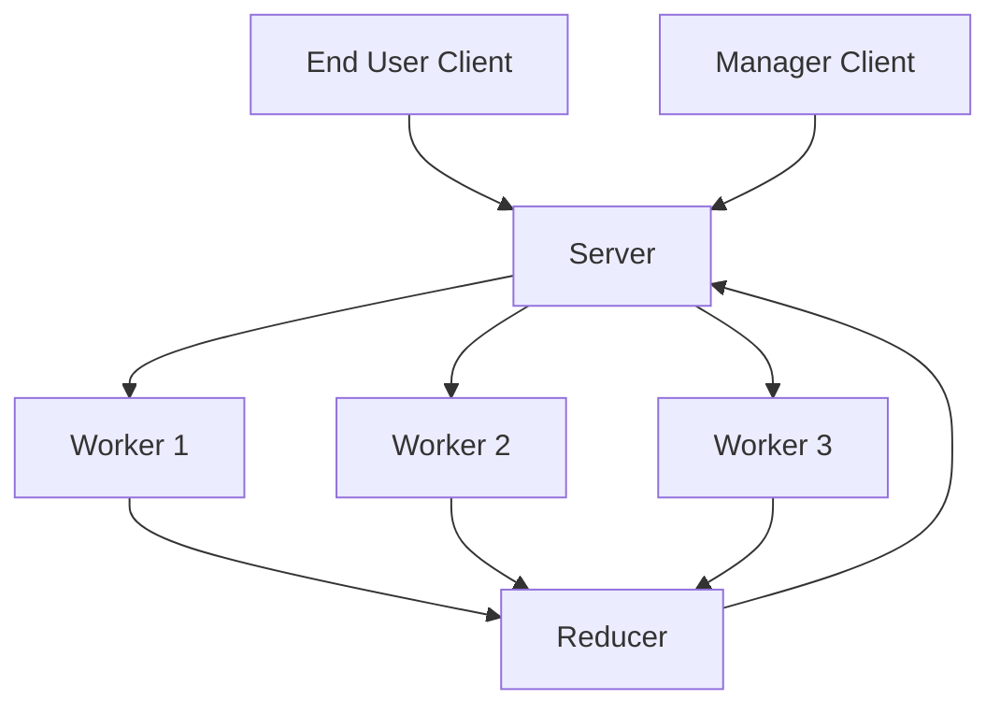
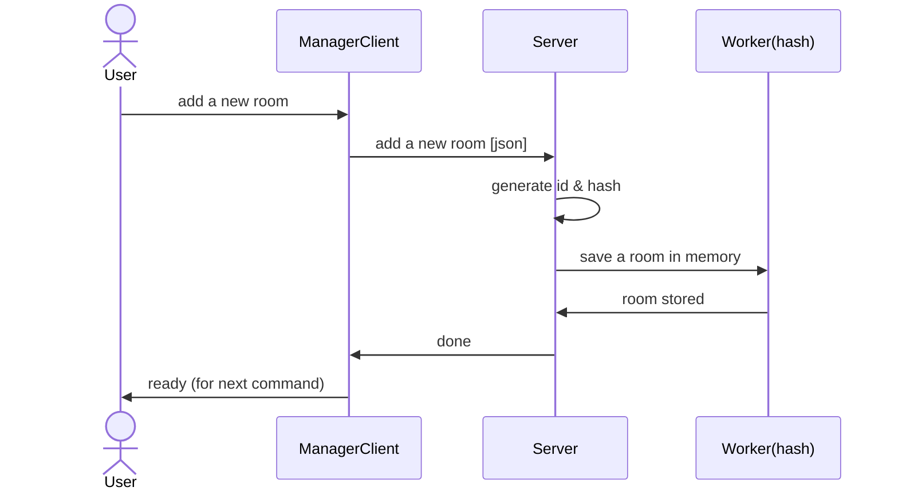
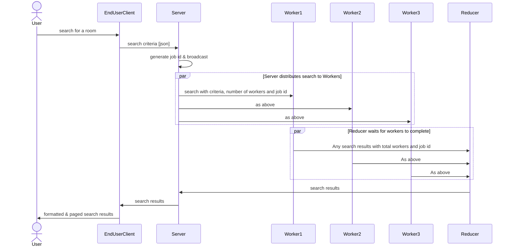
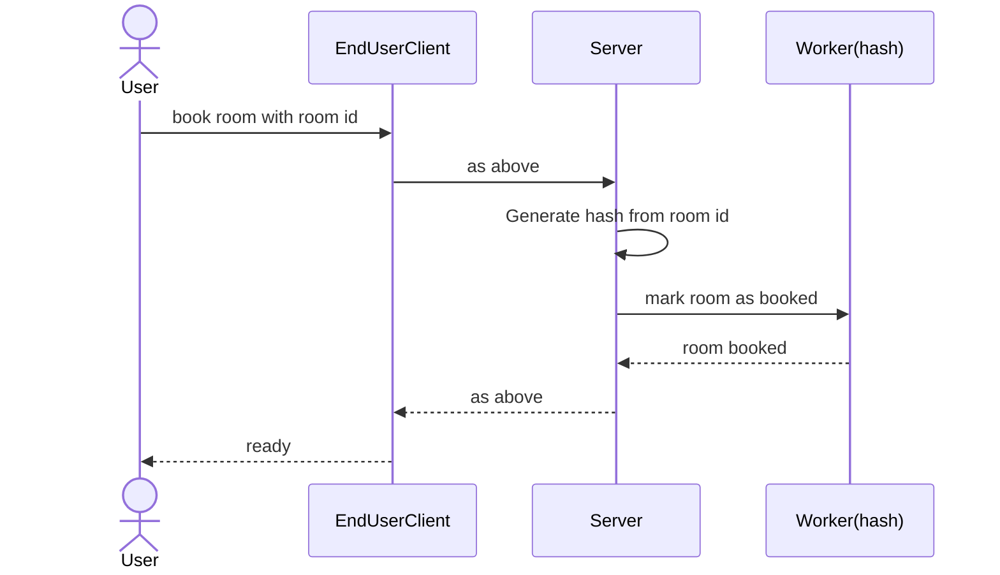
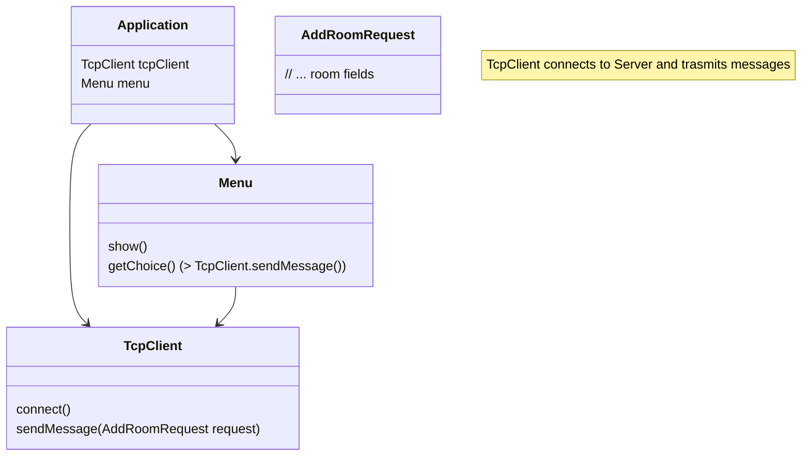
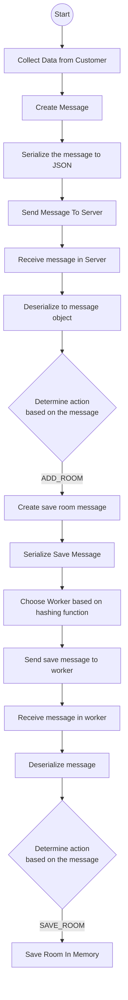

# Architecture

## Component Processes



---
## Component Interactions

### Operations

1. Manager to Server: Add a new room
2. End User to Server: Search for a room
3. End User to Server: Book a room

#### 1. Manager to Server: Add a new room



#### 2. End User to Server: Search for a room



#### 3. End User to Server: Book a room



---
## Process Architecture

### Client



## Communication Protocol

* All messages are transmitted in JSON.
* All messages will be contained in a *Message Envelope*.

    ```java
    class Message {
        private ClientType clientType;
        private MessageType messageType;

        // We will need to further process this to read the data 
        // of the message.
        private JsonNode data;
    }

    enum ClientType {
        SERVER,
        MANAGER_CLIENT,
        CUSTOMER_CLIENT,
        WORKER,
        REDUCER
    }

    enum MessageType {
        ADD_ROOM,
        SAVE_ROOM,
        WORKER_REGISTRATION,
        // more to come later
    }
    ```

---
## Process Flows

### 1. Adding a room

